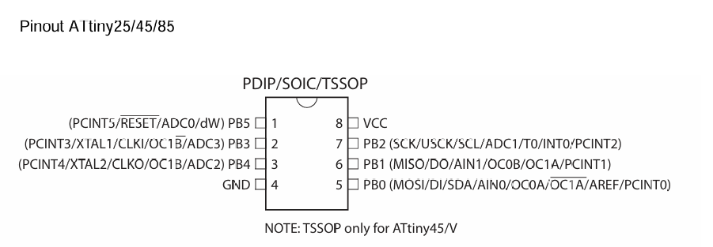

# IR-Transceiver-SAO

Event badges get lonely too. Why not have them chat with each other?    

A Programmable Infrared Multitool SAO. Gives a basic I2C interface to control and request or send data on IR.  
Takes care of basic functions such as transmission protocol, processing incoming transmission, and address checking

# PCB Build Instructions
- PCB Build component selection can be found at the [hackaday project site](https://hackaday.io/project/197812-infrared-communication-sao)  
- PCB Build video can be found [here](https://www.youtube.com/watch?v=JbmtGaDhfCs&ab_channel=AlecProbst)
  - Note: The buttons on the IR SAO must have the solder bridge soldered closed to be used
  - Note: The bottom button is used as a SAO reset by default. The top button is used for trigger a send of write buffer.
 
# Drivers
MicroPython Driver: https://github.com/DmitryPustovit/MicroPython-IR-Transceiver-SAO/tree/main  

# Installation
1. Download this Github
2. Open Visual Studio Code with PlatformIO installed
3. Open this project
4. Setup the ATTINY85 for programming
> - [This video](https://www.youtube.com/watch?v9hlY&ab_channel=Keon%27sLab) can be used as hardware connection reference from 2:42 to 8:15. Requires an Arduino Uno
5. Build and Upload using the given platformio.ini

# SAO Features
- Public and Address Mode: Two different modes that the IR SAO can automatically sort received IR transmissions
  - Default: Public Mode (mode = 0)
  - Public Mode: The IR SAO ignores the address of incoming IR transmissions. Will save any data of transmissions sent to it
  - Address Mode: The IR SAO will check the address of incoming IR transmissions. Will only save data of transmission with address that match it's IR address
    - IR Address: The 0-255 value address for IR communications.
    - Note: This is not the same as the I2C Address!
    - Note: IR Addresses of received transmissions are not saved on the SAO! 
- IR Receive Buffer: An internal buffer in the IR SAO which can save incoming transmissions. If buffer is not used, only the last transmission received is saved
  - Default: No Buffer (enable_buffer = false)
  - Note: Buffer is 256 Bytes long. Any data received after the buffer is filled is ignored
- IR Reflection Ignore: Prevents the receiver from saving any received transmissions with the same IR Address and Data during IR transmission time
  - Default: Ignores Reflections (ignore_ir_reflection = true)

# IR Communication Format
The IR SAO default IR Address is 0x00   
The IR SAO uses the NEC Transmission Protocol. We use [this](https://techdocs.altium.com/display/FPGA/NEC+Infrared+Transmission+Protocol) documentation from Altium as reference  
The NEC Transmission Protocol is made up of two main parts, the Address and the Command. The logical inverse of both the Address and Command is also sent allowing for parity checking which is done automatically in the TinyIRReceiver library  
* Address: An 8 bit value that specifies the device that should receive the transmission
* Command: An 8 bit value that specifies data. The format of this data is unspecified, it can be anything the user desires
* Note: The TinyIRReceiver Library also supports Extended NEC Protocol, Onkyo, and FAST but are not used in this code!

# I2C Communication Format
The IR SAO default I2C Address is 0x08   
Communications are made up of two parts. The first is the command and the second is the parameter(s). The Command is always sent first and the parameter(s) are sent subsequently as needed per command. Commands do not return any acknowledgement
* Command - uint8_t: Determines what action you would like for the IR SAO. List of commands below
* Parameter(s) - uint8_t[]: Extra data specifiec by each command. Separated in uint8_t chunks

# I2C Example Communications
- To change the address of the IR SAO to address 8, the master should send:  
`0x04 0x08`  
- To read a byte from the IR SAO, the master should send:  
`0x08`  
The master would then request a byte back and be sent back a received IR byte such as:  
`0x69`
- To send a byte of value 50 to the IR address of 230 over IR from the IR SAO, the master should send:  
`0x09 0xE6 0x32`

# I2C Command API
## ping
> Description: Debug command to sanity check 
> Command Value: 0x00 
> Parameters: None 
> Output: None 

## set_ignore_ir_reflection
> Description: Sets the receiver if it should or shouldn't ignore messages that were reflected from 
> Command Value: 0x01 
> Parameters: A uint8_t value of 0 or 1. 0 disables the check for ignoring IR reflections while 1 enables it. Other values are ignored 
> Output: None 

## set_ir_mode
> Description: Sets the send/receive mode of the IR system 
> Command Value: 0x02 
> Parameters: A uint8_t value of 0 or 1. 0 puts the SAO in public mode while 1 puts it in address mode. Other values are ignored 
> Output: None 

## enable_ir_buffer
> Description: Enables or disables the ability to buffer IR data on the ATTINY85. Note: clears the receive buffer when this is changed 
> Command Value: 0x03 
> Parameters: A uint8_t value of 0 or 1. 0 disables the receive buffer while 1 enables it. Other values are ignored 
> Output: None 
> Note: Clears the IR receive buffer when command is sent no matter what the new mode value is 

## set_ir_address
> Description: Sets the IR address of this ATTINY85 
> Command Value: 0x04 
> Parameters: A uint8_t value between 0 and 255. This value represents the IR address of the SAO 
> Output: None 

## get_ir_address
> Description: Send the IR address of this ATTINY85 over I2C 
> Command Value: 0x05 
> Parameters: None 
> Output: Returns a uint8_t value between 0 and 255. This value represents the IR address of the SAO 

## clear_ir_receive_buffer
> Description: Clears the IR Receive Buffer 
> Command Value: 0x06 
> Parameters: None 
> Output: None 

## get_ir_receive_buffer_avaliable
> Description: Get the number of bytes in the IR Receive Buffer 
> Command Value: 0x07 
> Parameters: None 
> Output: Returns a uint8_t value between 0 and 255. This value represents the number of bytes in the IR receive buffer 
> Note: Will still return 0 or 1 if the IR receive buffer is disabled 

## read_ir_byte
> Description: Send a byte from the IR Buffer. Bytes come in FIFO ordering. Buffer is left shifted with zeros 
> Command Value: 0x08 
> Parameters: None 
> Output: Returns a uint8_t value between 0 and 255. Value is received IR data in the received IR buffer 
> Note: It is not guarenteed that there will be a byte sent! Use get_ir_receive_buffer_avaliable to make sure there is a byte to read, otherwise nothing will get sent over I2C! 

## write_ir_byte
> Description: Send a byte out over IR. The first received i2c byte is the address and the second is the data 
> Command Value: 0x09 
> Parameters: Two uint8_t values between 0 and 255. The first value represents the IR address and the second represents data that will be transmitted 
> Output: None 

# Samples
A few samples provided to test various functions of the SAO
- Upload_Test: A LED Blink sketch which blinks an LED on Pin_PB2 of the ATTiny85
- I2C_Test: A I2C testing sketch which tests slave functionality on the ATTiny85
  - Note: The I2C Host sketch can be used as the I2C Master. Intended to be used with an Arduino Uno
- IR_Test: A IR LED and Receiver testing sketch which tests address and data sending and receiving on the IR SAO. Turns an LED on Pin_PB2 if the received IR signal has the correct address and data
- Receiver_Signal: A IR Test sketch which uses the IRremote library to test IR sending and receiving, displaying results through serial
- Tiny_Receiver_Button_Send: A IR Test sketch which uses the TinyIRReceiver library to test IR sending based on button input
- Tiny_Receiver_Signal_Info: A IR Test sketch which uses the TinyIRReceiver library to test IR receiving

# ATTiny85 Pinout

# Libraries  Used
- [ATtinySerialOut](https://github.com/ArminJo/ATtinySerialOut)
- [Arduino-IRremote](https://github.com/Arduino-IRremote/Arduino-IRremote)
